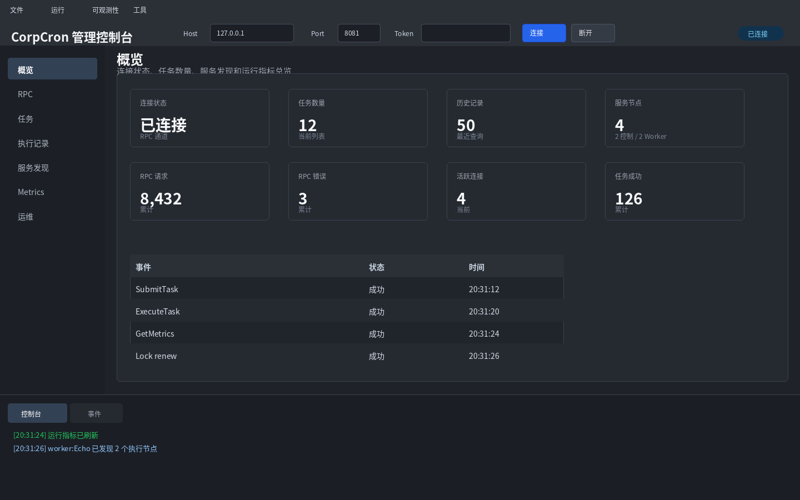
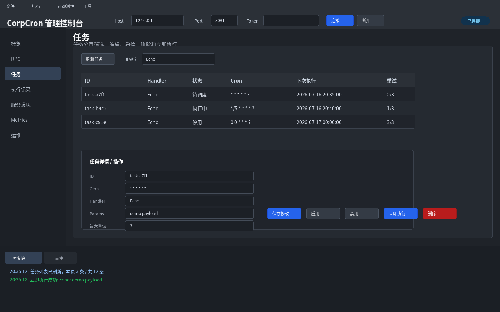
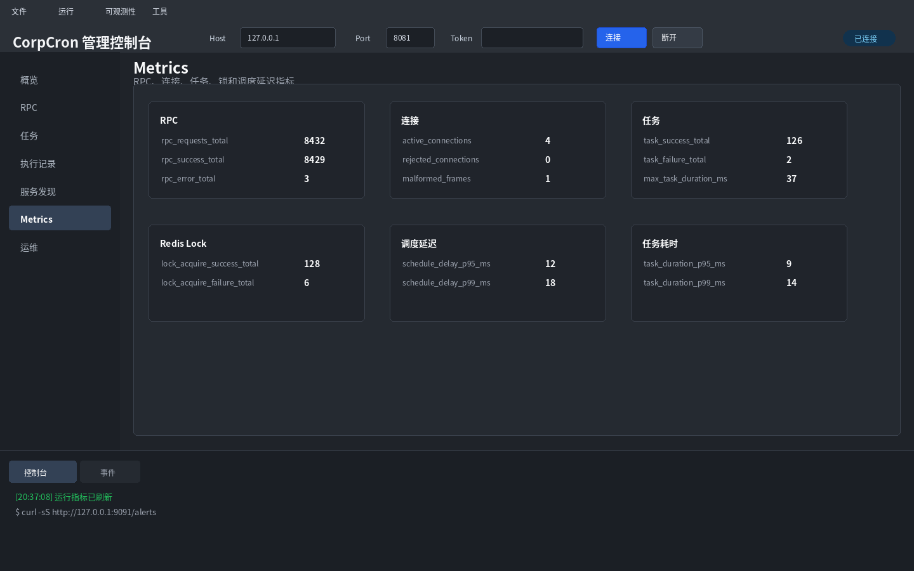
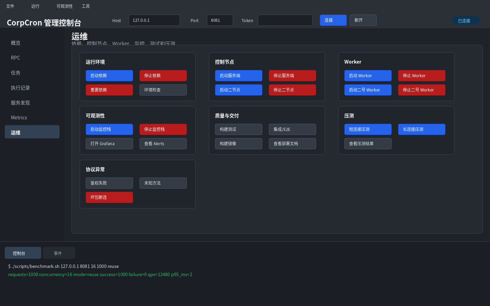
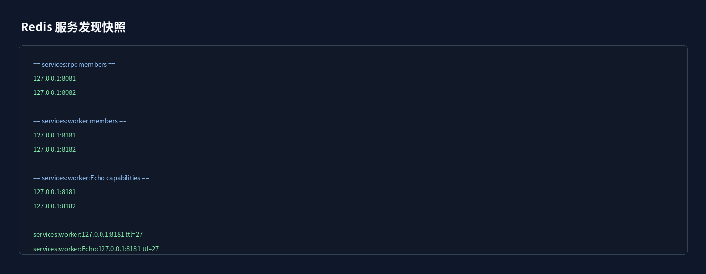
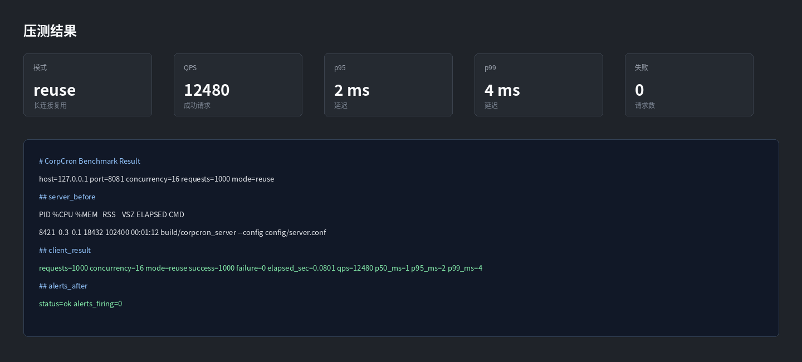
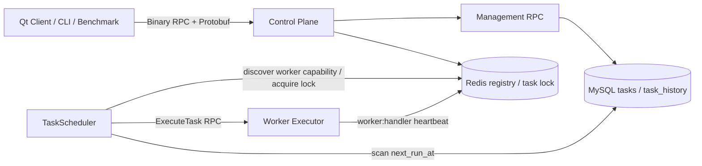

# Corpcron

Corpcron 是一个 C++20 实现的轻量级分布式定时任务调度项目，由控制节点、独立 Worker、Qt 管理端、MySQL 和 Redis 组成，包含自定义 RPC 协议、任务持久化、服务发现、分布式锁和可观测性链路。

## 功能

- 自定义 TCP RPC 协议，使用 Protobuf 编解码业务消息。
- `proto/rpc.proto` 声明 `CorpCronRpc` service，并通过脚本生成 C++ typed stub / skeleton 绑定。
- 支持简化版 server-side streaming，服务端可在同一请求内连续推送多帧响应。
- RPC 服务端支持 interceptor 中间件链，统一承载异常兜底、结构化日志和指标统计。
- 控制节点与执行节点分离：`corpcron_server` 负责管理和调度，`corpcron_worker` 负责执行 Handler。
- Worker 按 `worker:<handler>` 向 Redis 注册能力，调度器只把任务路由到支持对应 Handler 的节点。
- 没有匹配 Worker 时任务保持 `scheduled`，不会因执行节点暂时离线而消耗失败重试次数。
- TCP 事件循环只负责连接和收发，RPC 分发进入有界动态线程池；队列满时返回 `RESOURCE_EXHAUSTED`，慢 Handler 不会阻塞 epoll。
- Worker 内置 `Echo`、`Uppercase`、`Sleep` 和 `Fail` 演示 Handler，并接收 `task_id`、`execution_id` 与 deadline 执行上下文。
- RPC 包长校验，支持半包处理，并限制最大帧大小。
- Redis 服务注册、心跳续约、服务发现和分布式锁。
- MySQL 持久化任务、执行历史和下一次调度时间。
- 调度器按 `next_run_at` 查询到期任务，抢锁后执行并写入历史。
- 调度侧 RPC 客户端支持 Worker 连接池、round-robin、deadline/cancellation、标准健康检查和熔断半开探测。
- 任务状态机支持 scheduled/running/disabled 流转，认领时同时校验扫描到的 `next_run_at`，执行过程使用 `execution_id` 做幂等保护，并可回收节点崩溃后遗留的 running 状态。
- 任务失败后按指数退避重试，超过 `max_retries` 后自动禁用。
- 执行期间会续约 Redis 锁，降低长任务重复执行风险。
- 调度器支持任务 RPC 执行超时和取消语义，并对 Redis/MySQL 短暂断连做基础重连。
- Redis/MySQL 客户端支持连接池、连接/读写超时和基础错误分类，便于定位认证、连接、超时和 SQL 异常。
- 服务端为每个 RPC 请求生成 `request_id` 日志，并支持通过 RPC 查询运行指标。
- 指标包含任务执行耗时和调度延迟的 max、p95、p99，支持 `/metrics` 导出。
- 内置失败告警规则，支持通过 `/alerts` 查看 RPC 错误率、任务失败率、锁失败率和 p99 延迟异常。
- 提供 Prometheus、Alertmanager 和 Grafana 本地监控栈示例，支持长期指标采集、告警规则和可视化面板。
- RPC 支持统一错误响应 `RpcError`，便于客户端识别协议级错误。
- 支持基础 RPC token 鉴权、连接数上限和取消任务接口。
- Qt 可视化管理端支持任务提交、服务端分页筛选、编辑、启停、删除、立即执行、执行历史筛选和执行详情查看。
- Qt 演示控制台覆盖项目完整演示链路，支持控制节点与 Worker 单/双节点启停、HealthCheck、StreamMetrics、deadline/cancellation、熔断半开探测、监控栈启停、测试、压测、镜像构建、数据快照、部署材料查看和协议异常演示。
- 支持环境变量覆盖配置，避免在配置文件中提交真实密码。
- Docker Compose 提供 Redis/MySQL 开发环境。
- 提供 Dockerfile、控制节点/Worker systemd unit、Nginx 反向代理/TLS 示例和生产部署安全文档。
- CTest 接入基础协议、RPC 绑定、RPC 客户端和可选 Redis/MySQL 集成测试。
- 提供多节点压测脚本和报告，验证双节点吞吐、锁竞争、故障接管和重复执行保护。
- 提供工程检查脚本、格式配置和项目讲解文档，便于复现与答辩。

## 演示截图

### Qt 控制台概览



### 任务管理



### 运行指标



### 演示控制台



### Redis 服务发现



### 压测结果



### 系统架构



## 依赖

Ubuntu 22.04/24.04 可安装：

```bash
sudo apt update
sudo apt install -y g++ cmake libprotobuf-dev protobuf-compiler \
  libhiredis-dev libmysqlcppconn-dev qt6-base-dev qt6-tools-dev
```

如果只运行服务端和测试客户端，Qt 不是必需的；未安装 Qt 时 CMake 会跳过客户端。

## 快速启动

启动依赖：

```bash
docker compose up -d
```

Compose 中 Redis 对宿主机暴露为 `6380`，MySQL 暴露为 `3307`，避免占用本机常用的 `6379` 和 `3306`；服务端配置已默认连接这两个端口。

编译：

```bash
cmake -S . -B build
cmake --build build -j
```

启动 Worker：

```bash
./build/corpcron_worker --config config/worker.conf
```

运行控制节点：

```bash
./build/corpcron_server --config config/server.conf
```

启动 Qt 管理端：

```bash
./build/client/corpcron_client
```

Qt 端可以完成项目完整演示链路：启动/重置依赖、启动单/双控制节点与单/双 Worker、启动/停止监控栈、打开 Prometheus/Alertmanager/Grafana、连接 RPC、提交和分页管理任务、筛选执行历史并查看执行详情、查看 Worker 与 Handler 能力、查看运行指标、触发 HealthCheck 和 StreamMetrics 流式 RPC、查看 Redis/MySQL 快照、运行默认/集成测试、验证 deadline/cancellation、熔断半开探测和 generated streaming stub、触发短连接/长连接压测、构建 Docker 镜像、查看部署材料并演示鉴权失败、未知方法和坏包断连。若 Docker 需要 sudo 权限，请先在系统层面配置当前用户访问 Docker；如果环境里设置了 `DOCKER_HOST` 指向 Podman socket，Qt 会在启动工具命令时自动移除该变量。

提交测试任务：

```bash
./build/test_submit_client 127.0.0.1 8081
```

运行测试：

```bash
ctest --test-dir build --output-on-failure
```

一键工程检查：

```bash
./scripts/check.sh
```

可选运行格式检查：

```bash
./scripts/check.sh --format
```

如需自动启动 Docker 依赖并运行 Redis/MySQL 集成测试：

```bash
./scripts/check.sh --compose
```

运行 Redis/MySQL 集成测试：

```bash
CORPCRON_RUN_INTEGRATION_TESTS=1 ctest --test-dir build --output-on-failure
```

如果使用本机已有数据库，可以通过环境变量覆盖密码：

```bash
CORPCRON_RUN_INTEGRATION_TESTS=1 \
CORPCRON_MYSQL_PASSWORD=your_password \
ctest --test-dir build --output-on-failure
```

运行端到端调度测试也使用同一个开关。该测试会启动本地 TCP 服务，插入一个到期任务，并等待执行历史落库。

项目讲解提纲见 [docs/walkthrough.md](docs/walkthrough.md)。
项目能力摘要见 [docs/project-summary.md](docs/project-summary.md)。
完整演示流程见 [docs/guide/demo.md](docs/guide/demo.md)。
告警规则说明见 [docs/guide/alerting.md](docs/guide/alerting.md)。
监控栈说明见 [docs/guide/monitoring.md](docs/guide/monitoring.md)。

简单压测：

```bash
./scripts/benchmark.sh 127.0.0.1 8081 16 1000
```

压测结果会保存到 [docs/assets/benchmark/latest.txt](docs/assets/benchmark/latest.txt)，历史结果按时间戳保存在同一目录。

多节点压测：

```bash
./scripts/multinode_benchmark.sh 127.0.0.1 16 1000 reuse
```

多节点压测报告会保存到 [docs/assets/benchmark/multinode-latest.md](docs/assets/benchmark/multinode-latest.md)，用于验证双节点吞吐、Redis 锁竞争、节点故障接管和重复执行保护。

启动 Prometheus、Alertmanager 和 Grafana：

```bash
docker compose -f deploy/monitoring/docker-compose.monitoring.yml up -d
```

Grafana 默认访问 `http://127.0.0.1:3000`，账号密码为 `admin/admin`，会自动加载 CorpCron 总览面板。

演示前检查环境：

```bash
./scripts/demo_check.sh
```

清理演示数据：

```bash
./scripts/clean_demo_data.sh
```

## 配置

参考 [config/server.example.conf](config/server.example.conf)。
生产部署可参考 [config/server.production.example.conf](config/server.production.example.conf)，默认只监听本机地址，适合放在 Nginx TLS 代理后面。

常用环境变量覆盖：

```bash
CORPCRON_SERVER_LISTEN_PORT=8082
CORPCRON_SERVER_ADVERTISE_HOST=192.168.1.10
CORPCRON_WORKER_LISTEN_PORT=8182
CORPCRON_WORKER_ADVERTISE_HOST=192.168.1.11
CORPCRON_REDIS_PORT=6380
CORPCRON_MYSQL_PORT=3307
CORPCRON_MYSQL_PASSWORD=your_password
CORPCRON_RPC_AUTH_TOKEN=your_token
```

多节点部署时，每个控制节点和 Worker 应配置不同端口或不同机器地址，并分别设置可被其他节点访问的 `server.advertise_host` 与 `worker.advertise_host`。控制节点通过 `scheduler.worker_service_name` 发现 Worker。

## 数据库

初始化 SQL 位于 [sql/init.sql](sql/init.sql)。服务启动时也会对缺失的基础表和新增列做一次轻量补齐，方便从旧版本本地库平滑启动。

核心表：

- `tasks`：任务定义、状态、`next_run_at`、`last_run_at`、重试计数、当前执行 ID 和运行节点。
- `task_history`：每次执行的 `execution_id`、节点、结果、错误、开始/结束时间。

## 项目结构

```text
client/          Qt 客户端示例
config/          配置文件和样例
deploy/          生产部署、Nginx 和监控栈示例
generated/       Protobuf 生成代码
include/         公共头文件
proto/           Protobuf 定义
sql/             数据库初始化脚本
scripts/         启动和压测脚本
src/             控制节点、Worker 与核心实现
tests/           自动化测试
tools/           测试客户端和压测工具
```

## 当前限制

- RPC 已支持基础 Token 鉴权和连接数限制；服务端协议未内置 TLS，生产部署建议通过 Nginx stream 做 TLS 终止，不要直接裸露公网。
- Redis 锁已支持续约和失锁取消，超时 running 状态会在确认锁已释放后恢复；任务处理仍应按至少一次语义设计为幂等。
- 调度策略已使用 `next_run_at`，并支持 misfire、任务取消、任务编辑和立即执行。
- 控制节点与 Worker 已独立部署，Worker 通过 `worker:<handler>` 注册能力；内置 Handler 仍是进程内函数，未提供容器级任务沙箱和资源配额。
- deadline 会传播到 Worker，cancellation 可以终止调用方等待；已经开始运行的远端 Handler 需要自行检查 deadline，当前没有独立的远端取消控制帧。
- 服务端提供结构化关键链路日志、RPC 指标查询和 Prometheus 风格 `/metrics` 导出，便于压测和运行观测。
- 服务端提供 `/alerts` 轻量告警入口，适合本地演示和快速排查；项目也提供 Prometheus/Alertmanager/Grafana 示例用于长期采集和可视化。
- 自动化测试已覆盖协议、Redis/MySQL 集成和端到端调度链路；多节点压测脚本可验证锁竞争、故障接管和重复执行保护。

## 文档

- [文档入口](docs/README.md)
- [部署说明](docs/guide/deploy.md)
- [生产安全部署](docs/guide/production-security.md)
- [存储客户端调优](docs/guide/storage-tuning.md)
- [架构设计](docs/reference/design.md)
- [RPC 协议](docs/reference/protocol.md)
- [压测说明](docs/guide/benchmark.md)
- [多节点压测](docs/guide/multinode-benchmark.md)
- [告警说明](docs/guide/alerting.md)
- [监控栈说明](docs/guide/monitoring.md)
- [演示流程](docs/guide/demo.md)
- [项目摘要](docs/project-summary.md)
- [讲解提纲](docs/walkthrough.md)
